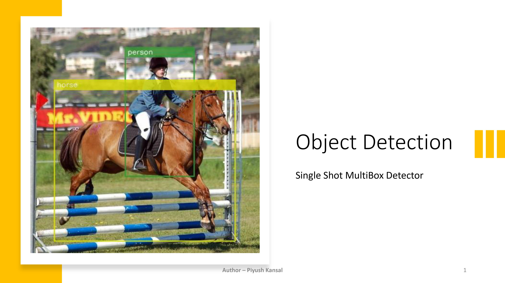
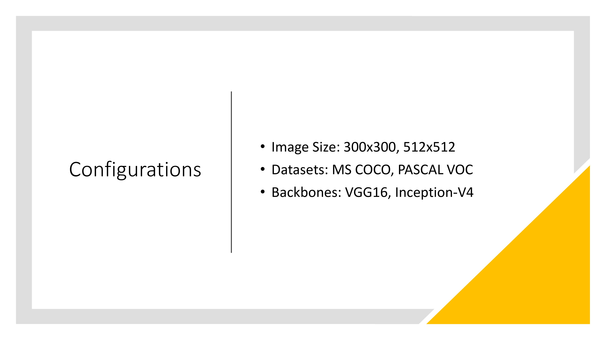
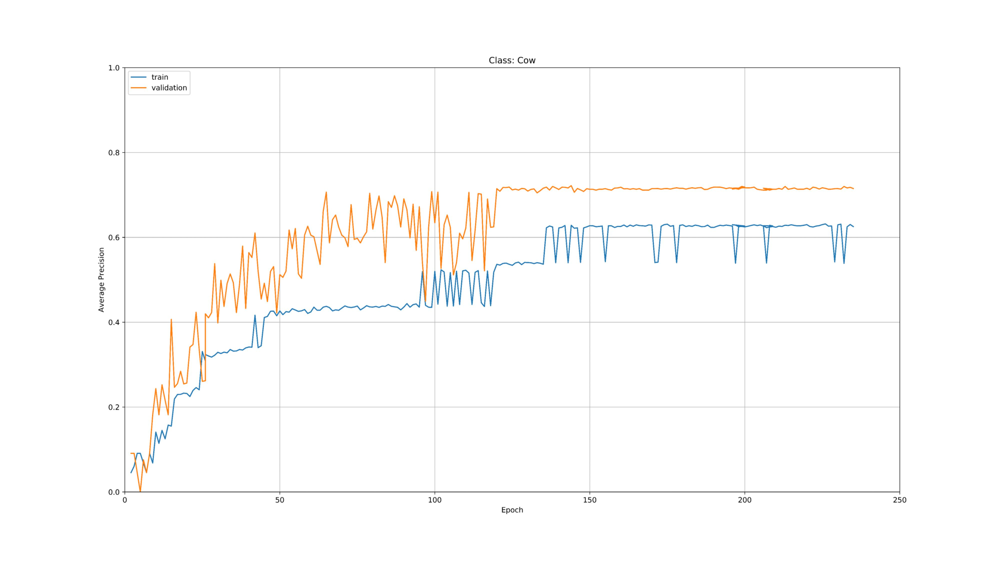

### Optimize the saved graph definition
python -m tensorflow.python.tools.optimize_for_inference \
--input=pascal-voc/frozen/e225-SSD300-VGG16-PASCALVOC.pb \
--output=pascal-voc/frozen/optimized-e225-SSD300-VGG16-PASCALVOC.pb \
--frozen_graph=True \
--input_names=image_input \
--output_names=result/result

